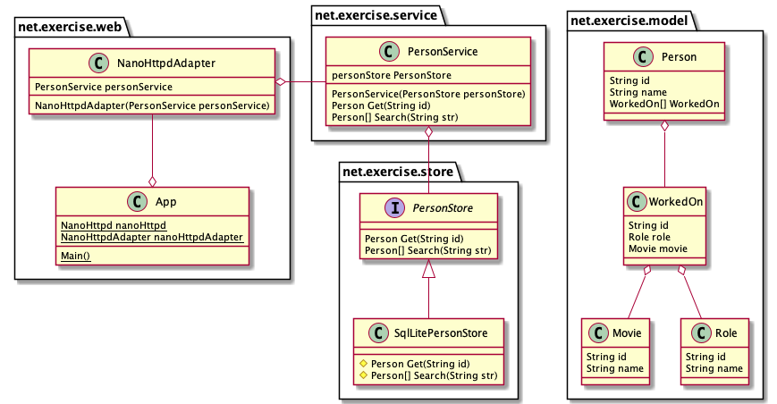

# Take Home Challenge Submission

## Design
This application is a web service that interfaces with a Sqlite3 database to support `get` and `search` operations on a set of person/movie data.
The implementation is divided into packages for web, store, service, and model classes. Dependency injection is used to create instances of a storage
interface that has specific knowledge of a database or other searchable persistent store.

### Class Diagram

#### `net.exercise.model`
Classes that implement immutable value objects.
These are the data types returned from get and search operations.

#### `net.exercise.store`
Definition of the `PersonStore` interface to storage systems for retrieving and searching for `Person` records.
This package also contains an implementation of this interface for Sqlite3.

#### `net.exercise.service`
Service class for retrieving and searching for `Person` records. This is meant to be the main
entry point for integration code that needs to get and search for `Person` records. Dependency injection
is used to provide instances of this class with an instance of `PersonStore` interface.

#### `net.exercise.web`
Main entry point for the web server. `NanoHttpdAdapter` serves as an adapter between the `PersonService` API interface
and the JSON request/response interface of the `NanoHTTPD` library.



## Development and Testing Tools
* openjdk version 11.0.12 2021-07-20
* Visual Studio Code with Extension Pack for Java v0.18.7
* Apache Maven 3.8.4
* jq 1.6
* curl 7.77.0
* sqlite3 3.36.0 2021-06-18
* GNU bash, version 3.2.57(1)-release (arm64-apple-darwin21)
* PlantUML 1.2021.14

## Database Setup
🚨 Note: There is a `movie-people.db` already setup and ready to go when you
clone this repository. Use the following to re-create the database as necessary.

Re-create and populate the database
```bash
sqlite3 data/movie-people.db < data/bootstrap.sql
```

## Running the Unit Tests

```bash
mvn test
```

## Starting the Web Service

```bash
mvn package
java -jar target/net-exercise-1.0-SNAPSHOT.jar
```

## Using the Web Service
🚨 Note: The URL path for *get* and *search* requests are `/get` and `/search` respectively.
### Get by ID
#### Request Format
```json
{"id":"<person id>"}
```
```bash
curl -X POST http://localhost:8181/get -H 'Content-Type: application/json' -d '{"id":"3"}' | jq
```
#### Example Response
```json
{
  "id": "3",
  "name": "Steve Zissou",
  "workedOn": [
    {
      "role": {
        "id": "2",
        "name": "directed"
      },
      "movie": {
        "id": "9",
        "name": "The Jaguar Shark"
      }
    }
  ]
}
```

### Search
#### Request Format
```json
{"str":"<search string>"}
```
```bash
curl -X POST http://localhost:8181/search -H 'Content-Type: application/json' -d '{"str":"toni"}' | jq
```
#### Example Response
```json
[
  {
    "id": "4",
    "name": "Antonio Calculon, Sr",
    "workedOn": [
      {
        "role": {
          "id": "3",
          "name": "stars"
        },
        "movie": {
          "id": "10",
          "name": "All My Circuits"
        }
      }
    ]
  }
]
```

## Rebuild Class Diagram Image
```bash
plantuml docs/class-diagram.plantuml
```
